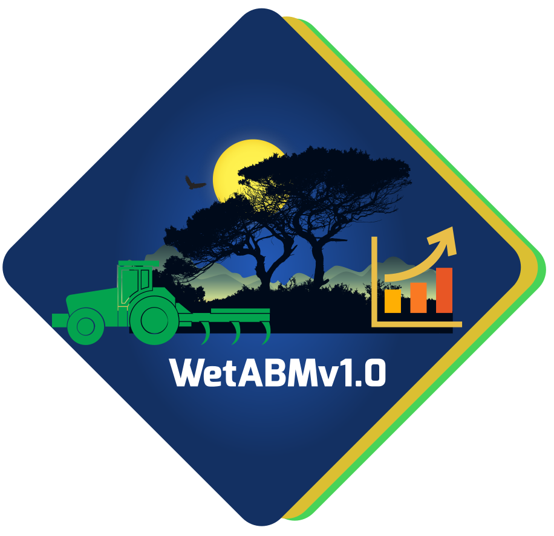
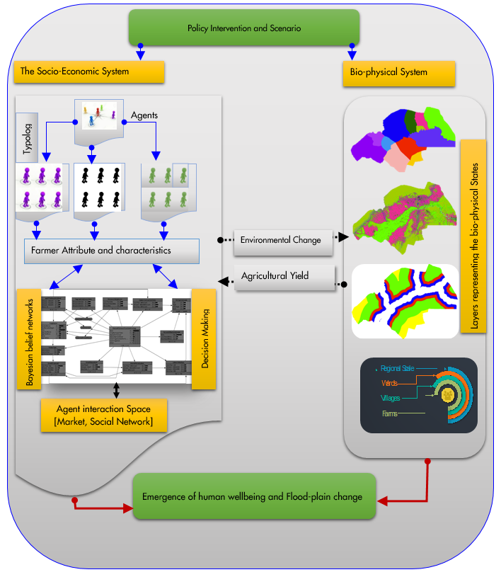
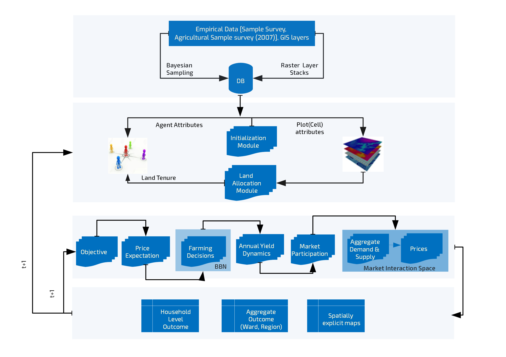
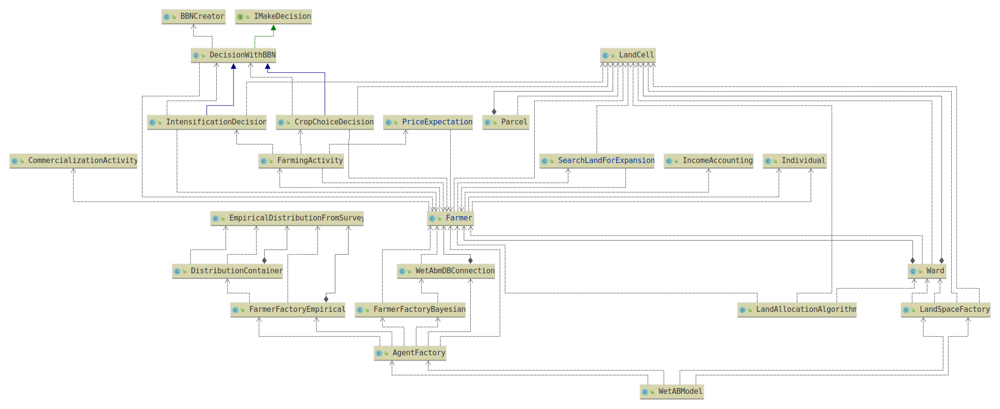

     
    
    <h1>WetABM</h1>
    <h3>A Repository of WetABM- a spatially explicit agent based model for Kilombero valley flood plain</h3>
    <a href = "mailto:bisrat.gebrekidan@ilr.uni-bonn.de">Bisrat Haile Gebrekidan </a>, Dr. Sebastian Rasch, Prof. Dr. Thomas Heckelei

---

WetABM is developed with the aim to analyse the dynamics of land use and farmer’s behaviour and response to different interventions in kilombero valley FloodPlain, Tanzania. 

WetABM incorporates heterogeneous agents (farmers) and their behaviour in terms of land use management situated within an explicitly spatial landscape structured into different hierarchical scales. The ABM provide us the ability to analyse the dynamics of interconnected systems through incorporation of feedbacks between the agents and the landscape systems. 
The software architecture of our model distinguishes different modules:

<ul style="list-style-type:square; margin-left:5%">
<li>Initialization module </li>
<li>Farm module</li>
<li>Land space module</li>
<li>Decision making module</li>
<li>And result collection and analysis module</li> 
</ul>

with further sub modules that provide specific functions and behaviours related to the main modules. For instance, the initialization module is responsible for the creation of agents (localisation of farms and design of landscape) and other parameters of the model for period zero. The farm module assigns attributes (characteristics) of the farm households (ID, household size, labour endowment, assets, list of farm plots, location, farmer type, crop type produced, etc..). Farmer attributes are parameterised based on our survey and the agricultural sample census from the government of Tanzania. The landscape module consists of a raster representation of important biophysical features of the floodplain. The stylized environmental space is organized hierarchically where raster cells represent plots and collection of plots form parcels owned by a single farmer. Villages are composed of collections of farm parcels which in turn form the landscape at ward and regional levels. Each raster cell, with a resolution of 1 hectare, has a value representing important landscape features such as land use and cover, elevation, distance from the river, distance from the market, flooding status, and village and ward boundaries). The data for the the biophysical characteristics employ different GIS techniques and harmonization in terms of scale and resolution is already completed. The decision making module addresses the land use decision making in terms of crop choice, intensification and expansion. At each point in time, the farmer makes decision on their farm plots by receiving information from the land cells. The module also incorporates a method for the calculation of crop yields using a quadratic production function calculating yields based on the conventional factors of production(land, labour , capital, fertilizer ), farmer managerial ability(farmer characteristics) and biophysical attribute of the plot (slope, elevation, distance from the river). This module also takes in to account the interaction between the farmers, for example representing imitation strategies.

---
# Modelling Framework   

 

---

# Model Structure 

---

  

---

# License
The current version of the model is built only for acadamic purpose. It part of Bisrats doctoral thesis at University of Bonn, [Institute of food and Resource Economics](#). The model is composed of a number of third party libraries, some of which are commercial(`NeticaJ`). The use of the model is subject to licence agreement of the respective library. 

---

# Disclamier
The model was developed under the [The GlobE: Wetlands in East Africa](https://www.wetlands-africa.uni-bonn.de/) and [TRR-228 Future Rural Africa](https://www.crc228.de/) projects. Both are funded by the German Federal Ministry of Education and Research, with additional funding provided by the German Federal Ministry
of Economic Cooperation and Development. The contents of this model are the sole responsibility of the authors and can in no way be taken to reflect the views of the funders. 
